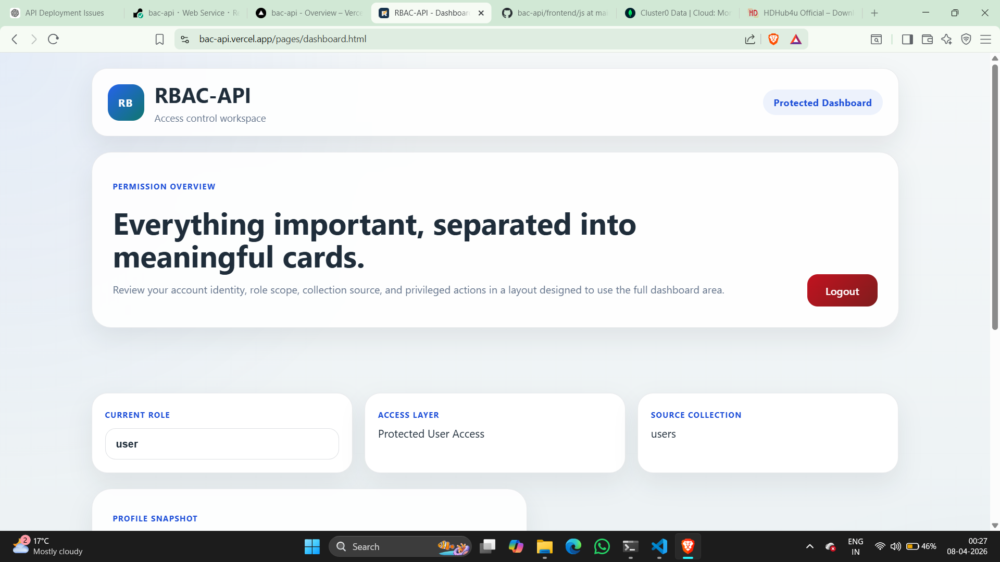

# RBAC-API

[](https://bac-api.vercel.app/pages/index.html)
[](https://bac-api-arcl.onrender.com)


Production-style RBAC demo built with Node.js, Express, MongoDB, and vanilla JavaScript. The project demonstrates authentication, role-aware authorization, protected routes, admin-only data access, and a deployed frontend/backend setup using Vercel and Render.

## Live Demo

- Frontend: https://bac-api.vercel.app/pages/index.html
- Backend API: https://bac-api-arcl.onrender.com

## Overview

This project is a full-stack role-based access control system with two core roles:

- `user` can authenticate and access protected profile data
- `admin` can access protected profile data and view all registered users

The frontend is a static multi-page app, and the backend exposes secure API routes that use JWT-based auth with HTTP-only cookies.

## Screenshots

### User Dashboard



### Admin Workspace


## Features

- User registration and login
- Secure password hashing with bcrypt
- JWT access and refresh token flow
- HTTP-only cookie-based authentication
- Route protection for authenticated users
- Role-based access control for `user` and `admin`
- Admin-only endpoint for listing all accounts
- Centralized middleware for auth, role checks, rate limiting, and CORS
- Deployed frontend and backend communication over HTTPS

## Deployment

This project is deployed as a split frontend/backend application:

- Frontend hosted on Vercel
- Backend hosted on Render
- Database connected through MongoDB

### Production Setup Notes

- The frontend uses the deployed Render API for production requests
- CORS is configured to allow the deployed Vercel frontend
- Auth requests use `credentials: "include"` for cookie-based session handling
- Render cold starts can make the first request slightly slower

## Tech Stack

### Backend

- Node.js
- Express.js
- MongoDB with Mongoose
- JSON Web Token (`jsonwebtoken`)
- `bcryptjs`
- `cookie-parser`
- `cors`
- `express-rate-limit`

### Frontend

- HTML5
- CSS3
- Vanilla JavaScript

---

## API Endpoints

### Auth

| Method | Endpoint | Description |
| --- | --- | --- |
| POST | `/api/auth/register` | Register a new user |
| POST | `/api/auth/login` | Log in an existing user |
| POST | `/api/auth/refresh` | Refresh auth session |
| POST | `/api/auth/logout` | Clear auth cookies |

### Users

| Method | Endpoint | Access | Description |
| --- | --- | --- | --- |
| GET | `/api/users/me` | Protected | Get current authenticated user |
| GET | `/api/users/all` | Admin only | Get all users across collections |

---

## Architecture

```text
Frontend UI
  -> Auth/API Client
  -> Express Routes
  -> Auth + Role Middleware
  -> Controllers
  -> MongoDB Models
  -> Database
```

---

## Environment Variables

Create a `.env` file inside `backend/` with values similar to:

```env
PORT=5000
MONGO_URI=your_mongodb_connection_string
JWT_SECRET=your_secret_key
FRONTEND_URL=http://localhost:5500
NODE_ENV=development
```

For deployed environments, `FRONTEND_URL` should point to your production frontend origin.

## Local Development

### 1. Clone the repository
```bash
git clone https://github.com/Star90lord/bac-api.git
cd bac-api
```

### 2. Install backend dependencies

```bash
cd backend
npm install
```

### 3. Start the backend server

```bash
npm start
```

The API runs at:

```text
http://localhost:5000
```

### 4. Run the frontend

Open one of the frontend pages directly, or serve the `frontend` folder with a local static server:

```text
frontend/pages/index.html
```

---

## Project Structure

```text
bac-api/
|-- backend/
|   |-- config/
|   |-- controllers/
|   |-- middleware/
|   |-- models/
|   |-- routes/
|   |-- utils/
|   |-- app.js
|   `-- server.js
|-- frontend/
|   |-- css/
|   |-- js/
|   |-- pages/
|   |-- login.png
|   `-- admin register.png
`-- README.md
```

---

## Security Highlights

- Passwords are hashed before storage
- Access to protected routes is verified by auth middleware
- Role checks gate admin-only functionality
- Auth state is handled with HTTP-only cookies
- Rate limiting helps reduce brute-force attempts
- CORS is explicitly configured for cross-origin frontend/backend communication

---

## Future Improvements

- Add automated tests with Jest and Supertest
- Add email verification and password reset flows
- Add API docs with Swagger or OpenAPI
- Add CI/CD checks for linting and deployment validation
- Improve audit logging for auth and admin actions

---

## Author

Altamsh Malik

GitHub: https://github.com/Star90lord
